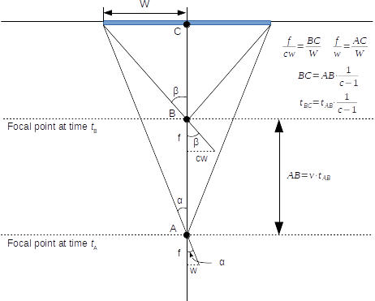

# Obstacle Avoidance Using Expansion Estimation

This project implements an interpretation of the algorithm developed by Mori and Scherer (paper [here](https://www-preview.ri.cmu.edu/pub_files/2013/5/monocularObstacleAvoidance.pdf)) for frontal obstacle detection using expansion cues from a monocular camera. The project code is integrated into the Robot Operating System architecture (ROS), allowing for a modular design that combines several components into a distributed framework.

## Assumptions for Obstacle Avoidance

+ Assume a rectangular coordinate system with whose origin is located the AR
Drone's frontal camera image plane. The horizontal and vertical axes
of the image plane define the X and Y axes and the Z axis is orthogonal to the image
plane pointing towards the front of the drone.

+ The drone moves along the Z-axis at a constant velocity with angular
velocities being negligible.

+ Obstacles are static or motion is dominated by camera motion.

+ Obstacles are sufficiently textured to be reliably detected by SURF algorithm.

## Derivation

The rate of change of scale of an object measured between two image frames is
inversely related the distance to the object. Assuming that the drone is headed
straight towards a point on an obstacle, we can estimate the Time to Contact
(TTC) with an object using only the rate of change in scale of an obstacle and
the time interval between two frames. Figure 1 below shows the derivation of
this relationship assuming the the pinhole camera model.




## Related works

### Camus, '95
[Real Time Optical Flow](ftp://ftp.cs.brown.edu/pub/techreports/94/cs94-36.pdf) 

Camus developed one of the first successful applications where optical vision was used for obstacle avoidance in real time. He developed a very efficient block matching optical flow algorithm that estimated flow by finding the best match across several time adjacent frames within a small spatial neighborhood. Camus solved the problem of obstacle detection by estimating the optical flow divergence at the point of the focus of expansion (FoE) in the optical flow field - the point around which optical flow radially diverges. It can be shown that the flow divergence is inversely proportional to the time to collision (TTC) with the object at the FoE and in this way obstacle detection is implemented. By assuming translational motion and only one obstacle in the scene, the FoE location was estimated by simply averaging optical flow over the entire image without respect to flow magnitude and iterativelyt reducing the window size to refine the measurement until it was reduced to a 4x4 window. His experiments showed good convergence to true TTC in an indoor environment, with a constant velocity of 5cm/s, negligible rotation, and neglible camera jitter.

### Zufferey, '05
[Toward 30-gram autonomous indoor aircraft: Vision based obstacle avoidance and altitude control](http://ieeexplore.ieee.org/xpl/login.jsp?tp=&arnumber=1570504&url=http%3A%2F%2Fieeexplore.ieee.org%2Fxpls%2Fabs_all.jsp%3Farnumber%3D1570504)

Zufferey developed a biologically inspired light weight airplane flyer with a few low res 1-D cameras and onboard vision processing that could explore a highly textured indoor environment without colliding into walls. The mode of information for obstacle avoidance here was decidedly simpler. Only the divergence of optical flow was estimated in regions of the image. By estimating the divergence on left, right, bottom, and top portions of the image, the horizontal and vertical differences between divergence were thresholded to trigger a saccadic reaction for obstacle avoidance. Importantly, an IMU was used to cancel out effects of rotational optical flow which introduce spurious measurements that are unrelated to the distance to obstacle.

### Sazbon, '04
[Finding the focus of expansion and estimating range using optical flow images and a matched filter](http://www.google.com/url?sa=t&rct=j&q=&esrc=s&source=web&cd=1&ved=0CB8QFjAA&url=http%3A%2F%2Fwww.researchgate.net%2Fpublication%2F220465015_Finding_the_focus_of_expansion_and_estimating_range_using_optical_flow_images_and_a_matched_filter%2Flinks%2F0912f5075b9704d923000000&ei=F3XqU7qMA6r1iwLG-YHIBA&usg=AFQjCNF870JdXZkd6Ne0rBoI4OS2Sw5ACg&sig2=wuc9MCENfjcY5n8TIi74Tw&bvm=bv.72676100,d.cGE)

Sazbon proposes a unique yet simple approach to focus of expansion detection. A filter is proposed that is simply a template of the focus of expansion - a square window of perfectly radially diverging optical flow. In matching, only the angle of optical flow is considered so that matching is invariant to flow magnitude. However, the experiments only include focus of expansion location on a few ideal images. The algorithm wasn't integrated into any actual application e.g. obstacle avoidance for a mobile robot.

### Dependencies


- `ardrone_autonomy`

- `opencv`


### Optional

* `uvc_camera`

- `ros-joy`

# Notes on Robot Operating System (ROS) 

**Installation**

1. Download ROS virtual machine at [RosVM](http://nootrix.com/downloads/#RosVM) or install the ros-packages onto your system (see the ROS installation instructions on their wiki).

**Step for building a catkin project**

1. Create project folder (e.g., ~/catkin_ws)

2. Create a folder for dependent packages ~/catkin_ws/src

3. Place source code into ~/catkin_ws/src with e.g. git clone <some_git_repo>

4. Make the packages with catkin

    ```bash
    $ cd ~/catkin_ws
    $ catkin_make
    ```

7. Set the path with setup.bash
    ```bash
    $ . ~/catkin_ws/devel/setup.bash
    ```

Now the packages and launch files should be available. For example, for the flownav package you could run
```bash
$ roslaunch flownav joystick.launch
$ roslaunch flownav flownav.launch
```

Good deal!


## Using screen

Emulates multiple terminals using one terminal session. Really useful when you
are running ROS on a VM with several processes outputting to the terminal that
you would like to monitor. Good intro here:
http://nathan.chantrell.net/linux/an-introduction-to-screen/

* C-a a to go to start of line
* C-a C-a to toggle between previously used window or C-n/C-p to tab forward/backward
* C-a c to create a new window
* C-a w to list active windows
* screen <some program> to run a program without opening an intermediate shell
* C-a k to kill a window
* C-a d to detach session
* screen -r to connect to open session


## Setting up virtualbox ssh server

1. sudo apt-get install open-ssh

2. Go to virtualbox main preferences
  1. Click network
  2. Click Host-only networks tab
  3. Add an adapter

3. Go to machine settings
  1. Click network
  2. Click Adapter 2 tab
  3. Set "Attached to" to Host-Only Adapter
  4. Restart machine

4. Edit /etc/network/interfaces and add something similar to the following

    ```
    auto eth1
    iface eth1 inet static
    address 192.168.56.2
    netmask 255.255.255.0
    network 192.168.56.0
    broadcast 192.168.56.255
    ```

5. Open /etc/hosts _inside the host machine_ and enter the line

    ```
    <IP>    <hostname>
    ```
